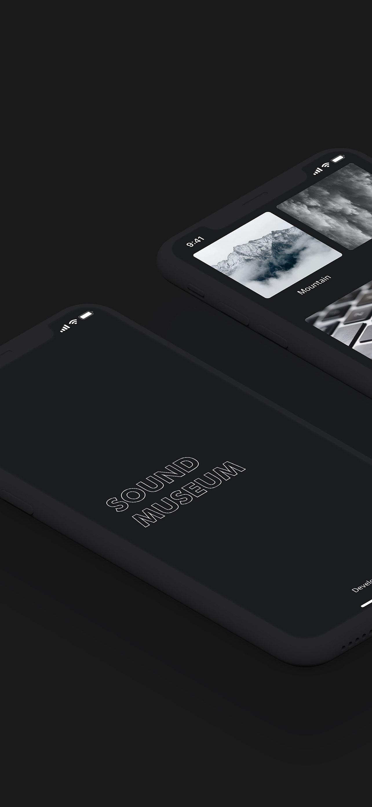
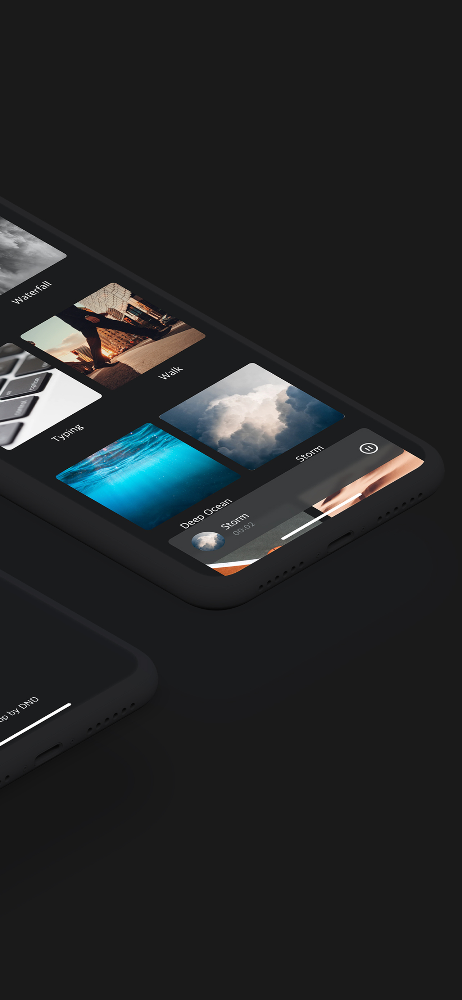
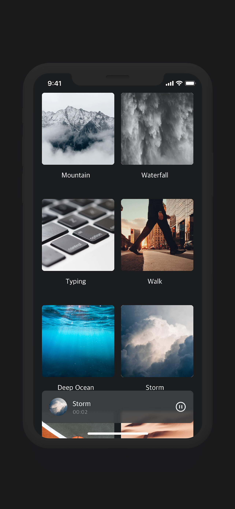

# SoundMuseum
ASMR 저장소

   

## Built with

| **Main Library** | **Development Tools** |
|:-:|:-:|
| [RxSwift](https://github.com/ReactiveX/RxSwift) [ReactorKit](https://github.com/ReactorKit/ReactorKit) [Moya](https://github.com/Moya/Moya) [Texture](https://github.com/TextureGroup/Texture) [Quick](https://github.com/Quick/Quick) [Nimble](https://github.com/Quick/Nimble)| [XcodeGen](https://github.com/yonaskolb/XcodeGen) [CocoaPods](https://github.com/CocoaPods/CocoaPods) [cocoapods-binary](https://github.com/leavez/cocoapods-binary) |